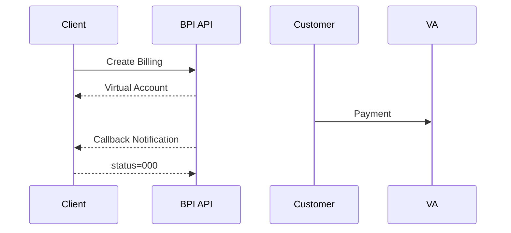

# 📄 BSI Pembayaran Institusi (BPI) API v1.3

## 1. Overview

BPI-API digunakan untuk integrasi pembayaran berbasis **Virtual Account (VA)**.

### Fitur

* Create Billing
* Inquiry Billing
* Update Billing
* Delete Billing
* Payment Notification (Callback)

---

## 2. Base URL

### Sandbox

```url
https://sandbox.api.bpi.co.id/ext/bnis/?fungsi=vabilling
```

### Production

```url
https://api.bpi.co.id/ext/bnis/?fungsi=vabilling
```

---

## 3. General Rules

* Method: `POST`
* Header: `Content-Type: application/json`
* Body: **Encrypted JSON**
* Response: **Encrypted (success), Plain (error)**

---

## 4. Security

* Menggunakan `secret_key` (32 hex)
* Enkripsi semua request & response
* Validasi timestamp (±5 menit)

---

## 5. Virtual Account Format

### Lintas Bank (Prefix 900)

```url
900 + kodeBPI (4 digit) + payment_number (5–12 digit)
```

### Internal BSI

```url
kodeBPI (4 digit) + payment_number (5–12 digit)
```

---

## 6. API Endpoint

### 6.1 Create Billing

**type:** `createbilling` / `createbillingsms`

#### Mandatory Parameters

| Field          | Keterangan        |
| -------------- | ----------------- |
| client_id      | kodeBPI           |
| trx_id         | ID unik transaksi |
| trx_amount     | nominal           |
| billing_type   | tipe billing      |
| customer_name  | nama              |
| customer_email | email             |
| customer_phone | nomor             |

#### Optional

* virtual_account
* datetime_expired
* description
* info
* minimal_payment

---

### 6.2 Inquiry Billing

**type:** `inquirybilling`

#### Mandatory

* client_id
* trx_id

#### Response Fields

* trx_amount
* virtual_account
* va_status
* payment_amount
* datetime_* (ISO8601 tersedia)

---

### 6.3 Update Billing

**type:** `updatebilling`

#### Catatan

* Harus kirim ulang semua field
* Tidak bisa ubah:

  * billing_type
  * virtual_account

---

### 6.4 Delete Billing

**type:** `deletebilling`

#### Catatan Delete

* Hanya bisa jika belum dibayar

---

### 6.5 Payment Notification

* Dikirim ke callback URL client
* Retry maksimal **5x jika gagal**

#### Response wajib

```json
{
  "status": "000"
}
```

---

## 7. Parameter Reference

| Parameter        | Tipe     | Keterangan    |
| ---------------- | -------- | ------------- |
| type             | string   | jenis request |
| client_id        | char(4)  | kodeBPI       |
| trx_id           | string   | unique ID     |
| trx_amount       | number   | tanpa desimal |
| billing_type     | char     | lihat tabel   |
| customer_name    | string   | nama customer |
| customer_email   | string   | email valid   |
| customer_phone   | string   | nomor HP      |
| virtual_account  | string   | nomor VA      |
| datetime_expired | datetime | ISO8601       |
| description      | string   | max 50 char   |

---

## 8. Billing Type

| Code | Deskripsi       |
| ---- | --------------- |
| o    | Open Payment    |
| c    | Fixed Payment   |
| i    | Installment     |
| m    | Minimum Payment |
| n    | Open Minimum    |
| x    | Open Maximum    |
| s    | One Time        |

---

## 9. VA Status

| Value | Status   |
| ----- | -------- |
| 1     | Active   |
| 2     | Inactive |

---

## 10. Status Code (Lengkap)

| Code | Message                          |
| ---- | -------------------------------- |
| 000  | Success                          |
| 001  | Incomplete / invalid parameter   |
| 002  | IP not allowed / wrong client_id |
| 004  | Service not found                |
| 005  | Service not defined              |
| 006  | Invalid VA number                |
| 008  | Technical failure                |
| 009  | Unexpected error                 |
| 010  | Request timeout                  |
| 011  | Billing type mismatch            |
| 012  | Invalid expiry date              |
| 013  | Decimal not allowed (IDR)        |
| 101  | Billing not found                |
| 102  | VA already used                  |
| 103  | Billing expired                  |
| 105  | Duplicate trx_id                 |
| 107  | Amount cannot be changed         |
| 111  | Billing already paid             |
| 200  | Failed send SMS                  |
| 201  | SMS only for fixed payment       |
| 401  | Delete denied                    |
| 997  | System offline                   |
| 998  | Invalid Content-Type             |
| 999  | Internal error                   |

---

## 11. Business Rules Penting

* `trx_id` **harus unik (tidak boleh reuse)**
* Billing tidak bisa dihapus jika sudah dibayar
* Update hanya boleh:

  * sebelum dibayar
  * atau nominal baru ≥ jumlah yang sudah dibayar
* Open payment (`o`) → `trx_amount = 0`
* Payment bisa:

  * single / multiple tergantung billing_type

---

## 12. Flow Transaksi



---

## 13. Catatan Integrasi

* Semua request harus dienkripsi
* Gunakan waktu server yang sinkron
* Callback harus:
  * reachable (public)
  * fast response
* Gunakan sandbox untuk testing:

```url
https://sandbox.bpi.co.id/ext/bnis/simulation/
```
